# Mapa de Dependencias Internas — Trazo

## Introducción

Este documento muestra qué módulos de Trazo dependen internamente de
otros módulos del proyecto. Es útil para entender el **impacto de
modificar un módulo base**: si cambias `contrato.js`, por ejemplo,
todos los métodos que lo importan podrían verse afectados.

> Este mapa refleja las dependencias verificadas en el código fuente
> al momento de crear este documento. Si agregas un nuevo método o
> modificas las importaciones de uno existente, actualiza este mapa.

---

## Módulos base (núcleo)

Estos módulos son importados por la mayoría de los métodos del proyecto.
Modificarlos tiene el mayor impacto potencial.

| Módulo base | Ubicación | Exporta |
|-------------|-----------|---------|
| `contrato.js` | `src/core/contrato.js` | `crearResultado`, `medirTiempo` |
| `errores.js` | `src/core/errores.js` | `ErrorParametros`, `ErrorConvergencia`, `ErrorDominio`, `ErrorDominio` |
| `validaciones.js` | `src/utils/validaciones.js` | `validarFuncion`, `validarNumero`, `validarIntervalo`, `validarMatrizCuadrada`, `validarVector`, `validarTolerancia`, `validarIteraciones` |
| `formato.js` | `src/utils/formato.js` | `redondear`, `errorAbsoluto`, `errorRelativo`, `errorPorcentual`, `aproximadamenteIgual` |

---

## Diagrama de dependencias

```mermaid
graph TD
    subgraph Core
        contrato["core/contrato.js"]
        errores["core/errores.js"]
        validaciones["utils/validaciones.js"]
        formato["utils/formato.js"]
    end

    subgraph EDO
        euler["edo/euler.js"]
        eulerMejorado["edo/euler-mejorado.js"]
    end

    subgraph Integracion
        simpson38["integracion/simpson-38.js"]
    end

    subgraph Interpolacion
        splines["interpolacion/splines.js"]
    end

    subgraph Lineales
        gauss["lineales/gauss.js"]
    end

    subgraph NoLineales
        falsaPosicion["no-lineales/falsa-posicion.js"]
        muller["no-lineales/muller.js"]
        puntoFijo["no-lineales/punto-fijo.js"]
    end

    subgraph Polinomios
        horner["polinomios/horner.js"]
    end

    euler --> contrato
    euler --> validaciones

    eulerMejorado --> contrato
    eulerMejorado --> errores
    eulerMejorado --> validaciones

    simpson38 --> contrato
    simpson38 --> errores
    simpson38 --> validaciones

    splines --> contrato
    splines --> errores

    gauss --> contrato
    gauss --> errores
    gauss --> validaciones

    falsaPosicion --> contrato
    falsaPosicion --> errores

    muller --> contrato
    muller --> errores
    muller --> validaciones
    muller --> formato

    puntoFijo --> contrato
    puntoFijo --> errores

    horner --> errores
```

---

## Tabla de dependencias por módulo

| Módulo | Depende de |
|--------|-----------|
| `edo/euler.js` | `core/contrato.js`, `core/validaciones.js` |
| `edo/euler-mejorado.js` | `core/contrato.js`, `core/errores.js`, `utils/validaciones.js` |
| `integracion/simpson-38.js` | `core/contrato.js`, `core/errores.js`, `utils/validaciones.js` |
| `interpolacion/splines.js` | `core/contrato.js`, `core/errores.js` |
| `lineales/gauss.js` | `core/contrato.js`, `core/errores.js`, `core/validaciones.js` |
| `no-lineales/falsa-posicion.js` | `core/contrato.js`, `core/errores.js` |
| `no-lineales/muller.js` | `core/contrato.js`, `core/errores.js`, `utils/validaciones.js`, `utils/formato.js` |
| `no-lineales/punto-fijo.js` | `core/contrato.js`, `core/errores.js` |
| `polinomios/horner.js` | `core/errores.js` |

---

## Impacto estimado por módulo base

| Si modificas... | Módulos potencialmente afectados |
|-----------------|----------------------------------|
| `core/contrato.js` | **Todos los métodos** que usan `crearResultado` o `medirTiempo` |
| `core/errores.js` | **Casi todos los métodos** que lanzan errores tipados |
| `utils/validaciones.js` | Métodos con validación de parámetros (euler, gauss, simpson, muller, etc.) |
| `utils/formato.js` | Métodos que calculan errores entre iteraciones (muller, y otros métodos iterativos) |

---

## Módulos sin dependencias internas

Los siguientes módulos base **no dependen de ningún otro módulo interno**
del proyecto — solo usan JavaScript nativo:

* `src/core/contrato.js`
* `src/core/errores.js`
* `src/utils/validaciones.js`
* `src/utils/formato.js`

Esto los hace seguros de modificar en aislamiento, siempre que se
mantenga la misma interfaz pública (nombres y tipos de las funciones
exportadas).